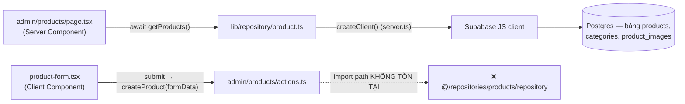

# Scaffold dự án + CRUD sản phẩm đầu tiên — 27/08/2026

> Commit: `e692944` (Initial commit from Create Next App) → `c97c28b` (Commit2(byMinh))

## Phạm vi thay đổi

96 file thay đổi, +11966/-478 dòng. Đây là commit dựng khung toàn bộ dự án từ `create-next-app` mặc định thành app ecommerce có cấu trúc. Nhóm lại theo mục đích:

1. **Cấu hình & docs**: khởi tạo shadcn (`components.json`), thêm hàng loạt dependency (`@supabase/ssr`, `@tanstack/react-table`, `@dnd-kit`, `recharts`, `radix-ui`, `sonner`...), thêm bộ tài liệu tiếng Việt trong `docs/` (`architect..md`, `features.md`, `roadmap.md`, `techstack.md`, `treeFolder.md`, `workflow.md`) và `MINH.md`.
2. **Route scaffold**: dựng toàn bộ cấu trúc route `(auth)`, `(shop)`, `admin` — phần lớn là file rỗng (khung), chỉ `(shop)/page.tsx`, `(shop)/layout.tsx`, `admin/*` có nội dung thật.
3. **Admin dashboard template**: copy nguyên block admin dashboard của shadcn — `components/admin/{app-sidebar,data-table (921 dòng),chart-area-interactive,nav-*,section-cards,site-header}.tsx` + toàn bộ `components/ui/*` (shadcn primitives).
4. **Tầng data đầu tiên**: `lib/supabase/{client,server,middleware}.ts`, `lib/repository/product.ts` (CRUD product thô), 6 file `types/{product,category,order,cart,profile,product_image}.ts` (alias Row/Insert/Update từ `database.types.ts`).
5. **Admin Products CRUD đầu tiên**: `admin/products/{page,new/page,[id]/page,actions.ts}` + `admin/products/components/product-form.tsx`.
6. `src/app/page.tsx` mặc định của create-next-app (69 dòng) bị xoá, thay bằng `(shop)/page.tsx` tối giản.

## Luồng hoạt động

Luồng đọc dữ liệu (list sản phẩm) hoạt động bình thường: Server Component gọi thẳng repository, repository gọi Supabase. Luồng ghi dữ liệu (tạo sản phẩm) bị đứt ngay từ commit này (xem mục dưới).

## Vấn đề phát hiện khi review

- **CRITICAL** — `admin/products/actions.ts` import `createProduct` từ `@/repositories/products/repository`, một đường dẫn **chưa từng tồn tại** trong repo (repository thật nằm ở `@/lib/repository/product`). Lỗi này có mặt **ngay từ commit này**, không phải phát sinh sau. Hệ quả: form tạo sản phẩm mới (`admin/products/new`) crash ngay khi build/chạy tới trang đó.
- **WARNING** — `lib/repository/product.ts`: `console.error("Error fetching products:", error)` chỉ log message tĩnh, không log chi tiết object lỗi từ Supabase (khó debug khi query sai cấu trúc join). Đã được tự sửa ở commit kế tiếp.
- **WARNING** — `lib/supabase/middleware.ts` (`updateSession()`) được viết sẵn nhưng chưa có `middleware.ts` ở root gọi nó — cơ chế refresh session chưa hoạt động dù code đã tồn tại.
- **NITPICK** — `components/admin/data-table.tsx` (921 dòng) là nguyên bản block mẫu của shadcn, gồm cả logic drag-and-drop và schema Zod mẫu với field không liên quan (`reviewer`, `type`, `status` kiểu chart) — chưa được rút gọn theo domain sản phẩm thật.

## Giải thích khái niệm liên quan

- **Alias type từ schema DB**: `types/product.ts` định nghĩa `Product = Database["public"]["Tables"]["products"]["Row"]` — tránh phải gõ lại đường type dài dòng ở mọi nơi dùng tới; khi schema Supabase đổi, chỉ cần generate lại `database.types.ts`.
- **3 kiểu Supabase client (client/server/middleware)**: khác nhau ở cách đọc/ghi cookie session theo từng runtime (browser dùng `document.cookie` ẩn qua SDK, Server Component dùng `next/headers`, middleware tự quản request/response cookie thủ công) — đây là yêu cầu bắt buộc của `@supabase/ssr`, không phải lựa chọn tuỳ ý.
- **Route group `(auth)`, `(shop)`**: dấu ngoặc đơn trong tên thư mục không xuất hiện trong URL, chỉ dùng để nhóm route dùng chung layout mà không đổi path (`(shop)/page.tsx` → `/`, không phải `/shop`).

## Việc cần làm / follow-up

- Sửa import path hỏng trong `admin/products/actions.ts` (đã được thay bằng pipeline mới ở bản cập nhật 31/08/2026 — nhưng file này bản thân nó chưa được sửa/xoá, xem file review ngày 2026-08-31).
- Nối `middleware.ts` ở root gọi `updateSession()`.
- Rút gọn `data-table.tsx` theo domain thật (đã được thay thế ở bản cập nhật sau).
