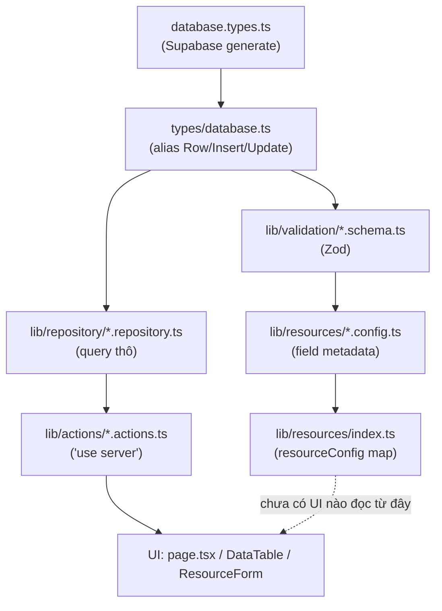

# Refactor sang resource-driven CRUD pattern — 31/08/2026

> So sánh: commit `4222106` (Commit 3, HEAD) → working tree hiện tại (chưa commit)

## Phạm vi thay đổi

**File bị xoá (tracked):**
- `admin/categories/{page,new/page,[id]/page}.tsx` — 3 file rỗng bị xoá, không còn UI category nào.
- `components/admin/data-table.tsx` (916 dòng) — bản table cũ, gộp 1 file.
- `lib/repository/product.ts` (143 dòng) — repository cũ.
- `types/{cart,category,order,product,product_image,profile}.ts` + `types/database.types.ts` — 7 file, gộp về vị trí mới.

**File sửa (tracked):**
- `CLAUDE.md` — file mới hoàn toàn (+128 dòng), tài liệu hướng dẫn Claude Code.
- `docs/architect..md`, `docs/treeFolder.md` — cập nhật sơ đồ kiến trúc mục tiêu, thêm nhánh Repository / Resource Config / Zod / Server Action.
- `admin/products/page.tsx` — đổi import sang `product.repository.ts` mới + `DataTable` mới kèm `columns`.

**File mới (untracked — chưa `git add`, không nằm trong `git diff HEAD`):**
- `docs/crudPageWorkFlow.md`, `docs/learning-log/`
- `components/admin/data-table/` (folder mới: `data-table.tsx`, `columns.tsx`, `data-table-features.ts`) — thay thế file đơn cũ
- `lib/actions/{product,order,category}.actions.ts`
- `lib/repository/{category,order,product}.repository.ts`
- `lib/resources/{types,index,product.config,order.config,category.config}.ts`
- `lib/validation/{product,order,category}.schema.ts`
- `lib/supabase/database.types.ts` (type Supabase-generated dời vào đây)
- `types/database.ts` — gộp alias Row/Insert/Update của mọi bảng vào 1 file, thay 6 file `types/*.ts` cũ

## Luồng hoạt động

Đây là pipeline **mới**, thay thế cách làm "mỗi entity code riêng" ở 2 commit trước. Giải thích khái niệm chi tiết từng tầng đã có ở `docs/learning-log/01-admin-crud-resource-pattern.md` — file review này tập trung vào **việc gì đã thay đổi và rủi ro gì phát sinh**, không lặp lại phần giải thích khái niệm.

## Vấn đề phát hiện khi review

- **CRITICAL** — `admin/categories/*` (toàn bộ UI) bị xoá nhưng UI generic thay thế (`admin/[resource]/`) **chưa được xây**. Kết quả: tính năng quản lý category trên admin **biến mất hoàn toàn** khỏi ứng dụng ở thời điểm này (trước đó có trang, dù chỉ là khung rỗng — giờ không còn route nào).
- **CRITICAL (kế thừa, chưa được xử lý trong đợt refactor này)** — `admin/products/[id]/page.tsx` vẫn import trực tiếp từ `@/repositories/products/repository`, path chưa từng tồn tại kể từ Commit2. `admin/products/actions.ts` (được `product-form.tsx` gọi khi submit) cũng import từ path đó. Đợt refactor này **xoá `lib/repository/product.ts`** (repository cũ) và thay bằng `lib/repository/product.repository.ts`, nhưng không chạm tới 2 file trên — nghĩa là chúng vẫn hỏng y như trước, độc lập với việc xoá file lần này (không phải lỗi mới phát sinh do refactor, chỉ là chưa được dọn theo).
- **WARNING** — `lib/actions/*.actions.ts` (mới) gọi thẳng repository để insert/update, **chưa gọi qua** `lib/validation/*.schema.ts` — tầng validate đã được định nghĩa nhưng chưa "gắn dây" vào action, nên hiện tại dữ liệu sai vẫn có thể lọt xuống DB nếu action được gọi trực tiếp (không qua form có validate phía client).
- **WARNING** — `components/admin/data-table/columns.tsx`: type đặt tên `Payment`, action dropdown ghi "Copy payment ID" / "View customer" / "View payment details" — nguyên văn ví dụ mẫu domain "payment" trong tài liệu shadcn, chưa đổi sang domain "product" thật; các menu item cũng **chưa có `onClick` xử lý gì** (bấm vào không có tác dụng).
- **NITPICK** — `lib/resources/*.config.ts` (product/order/category) đã khai báo đầy đủ field nhưng **chưa có file nào trong `src/app` import `resourceConfig`** — lớp UI generic mô tả trong `docs/treeFolder.md` (vừa được cập nhật sơ đồ) vẫn dừng ở mức thiết kế, chưa phải code chạy được.

## Giải thích khái niệm liên quan

- **TanStack Table v9 — khai báo feature tường minh**: `data-table-features.ts` dùng `tableFeatures({ columnFilteringFeature, rowPaginationFeature, ... })` để chọn đúng tính năng cần dùng; feature không khai báo sẽ bị tree-shake khỏi bundle. Khác cách "bật sẵn hết" quen thuộc ở v8 (`useReactTable` với `getFilteredRowModel()` gọi trực tiếp).
- **Vì sao xoá file cũ trước khi có file thay thế hoàn chỉnh là rủi ro**: `admin/categories/*` bị xoá "sạch" trước khi UI generic sẵn sàng — đây là ví dụ thực tế của việc refactor theo kiểu "dọn trước, xây sau" thay vì "xây song song rồi mới dọn" (strangler pattern) — dễ tạo ra khoảng trống tính năng tạm thời như đã thấy ở đây.
- Các khái niệm nền (repository pattern, config-driven UI, Zod + `z.infer`) đã giải thích chi tiết ở `docs/learning-log/01-admin-crud-resource-pattern.md`, không nhắc lại ở đây để tránh trùng lặp — hai loại tài liệu phục vụ hai mục đích khác nhau: `changelog-review` audit theo từng lần cập nhật, `learning-log` là hiểu biết bền vững được cập nhật dần.

## Việc cần làm / follow-up

- Xây UI generic `admin/[resource]/` (đọc từ `resourceConfig`) để thay thế các trang `admin/categories` vừa bị xoá — ưu tiên cao vì đang mất tính năng.
- Sửa `admin/products/actions.ts`, `admin/products/[id]/page.tsx`, `product-form.tsx` để dùng đúng `lib/repository/product.repository.ts` + `lib/actions/product.actions.ts` mới; xoá hẳn code cũ (`admin/products/actions.ts`, `admin/products/components/product-form.tsx`) khi UI generic thay thế xong.
- Gắn Zod validate (`lib/validation/*.schema.ts`) vào `lib/actions/*.actions.ts` trước khi gọi repository.
- Đổi `columns.tsx` từ domain "Payment" mẫu sang domain "Product" thật, gắn xử lý thật cho các item trong dropdown menu.
