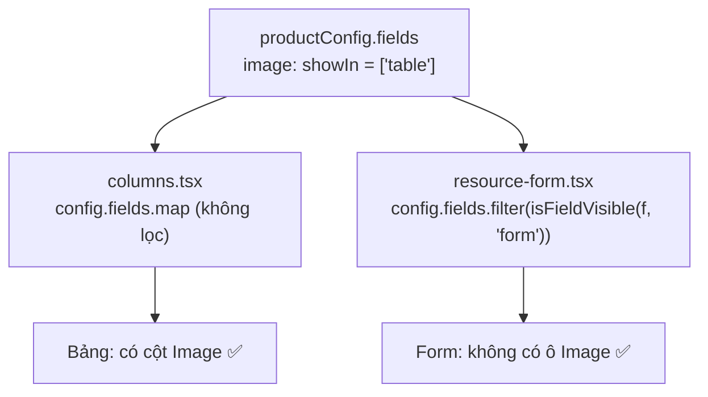
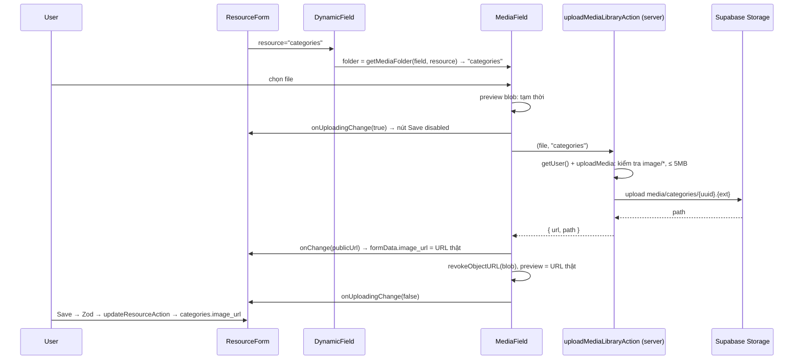

# Media field upload theo resource + ẩn field ảo khỏi form — 29/09/2026

> So sánh: commit `c4eb753` (HEAD) → working tree hiện tại (chưa commit).
> Chỉ ghi các file thuộc tính năng này. Các thay đổi về `ProductImageManager` / `product-image.actions.ts` / `product-images.repository.ts` có trong working tree nhưng thuộc tính năng khác.

## Phạm vi thay đổi

Tính năng gồm 2 phần:

**Phần A: ẩn field ảo khỏi form (`showIn`)**

| File | Thay đổi |
|---|---|
| `src/lib/resources/types.ts` | Thêm `FieldView = "table" \| "form"`, thêm `showIn?: FieldView[]` vào `ResourceField`. `media.accept` chuyển thành optional, thêm `media.folder?` |
| `src/lib/resources/field-utils.ts` (mới) | `isFieldVisible(field, view)` và `getMediaFolder(field, resource)` |
| `src/components/admin/resource-form/resource-form.tsx` | Lọc `config.fields` qua `isFieldVisible(field, "form")` trước khi render |
| `src/lib/resources/product.config.ts` | Field `image` thêm `showIn: ["table"]` |

**Phần B: `MediaField` upload thật lên bucket theo folder của resource**

| File | Thay đổi |
|---|---|
| `src/components/admin/resource-form/resource-form.tsx` | Truyền `resource` xuống `DynamicField`. Thêm state `uploadingCount` và chặn submit khi đang upload |
| `src/components/admin/resource-form/dynamic-field.tsx` | Nhận `resource`, `onUploadingChange`. Tính folder bằng `getMediaFolder` rồi truyền `folder`, `accept` xuống `MediaField` |
| `src/components/admin/resource-form/media-field.tsx` | Bỏ việc ghi `blob:` URL vào form. Gọi `uploadMediaLibraryAction(file, folder)` và `onChange(publicUrl)` |
| `next.config.ts` | `experimental.serverActions.bodySizeLimit = "6mb"` |

Không đổi: `src/lib/actions/media.actions.ts` (dùng lại `uploadMediaLibraryAction` có sẵn), `columns.tsx`, `category.config.ts`, Zod schema.

## Luồng hoạt động

### Phần A: một config, hai nơi hiển thị

Field `image` của product **không phải cột DB**. `getProducts()` (`product.repository.ts`) join `product_images`, chọn ảnh `is_primary` (hoặc ảnh đầu tiên) rồi gắn vào `product.image`. Bảng cần field này để hiện thumbnail, form thì không, vì không có cột nào để lưu.

Luật của `isFieldVisible`:

| `showIn` | `view` | Kết quả |
|---|---|---|
| (không khai báo) | bất kỳ | `true` (mặc định hiện ở mọi nơi) |
| `["table"]` | `"table"` | `true` |
| `["table"]` | `"form"` | `false` |

### Phần B: upload ảnh theo folder của resource

Chọn folder:

| `field.media?.folder` | `resource` | Folder |
|---|---|---|
| (không có) | `categories` | `categories` |
| `"banners"` | `categories` | `banners` (config ghi đè) |

Nhờ vậy ảnh vào đúng folder mà trang Media Library (`media.config.ts`: Products / Categories / Banners) đang liệt kê.

## Vấn đề phát hiện khi review

**Đã sửa trong lần cập nhật này**
- 🔴 **critical**: `MediaField` cũ gọi `onChange(URL.createObjectURL(file))`, tức là **lưu chuỗi `blob:http://...` vào `categories.image_url`**. Blob URL chỉ sống trong tab hiện tại, nên reload là ảnh chết. Giờ chỉ URL public từ Storage mới được ghi vào form.
- 🔴 **critical**: Server Action mặc định giới hạn body **1MB**, trong khi `uploadMedia` cho phép ảnh tới 5MB, nên ảnh chụp điện thoại sẽ lỗi. Đã nâng lên `6mb` (có dư cho overhead multipart).
- 🟠 **warning**: Field ảo `image` của product hiện trong form. Sau khi upload hoạt động, file sẽ bị đẩy lên bucket nhưng URL bị Zod bỏ (`product.schema.ts` không có `image`), sinh file rác. Đã ẩn bằng `showIn: ["table"]`.
- 🟠 **warning**: Bấm Save khi ảnh chưa upload xong thì formData chưa có URL. Đã chặn bằng `uploadingCount`.

**Còn tồn tại**
- 🟠 **warning: file mồ côi (orphan) trong bucket.** Ảnh upload **ngay khi chọn**, không phải lúc Save. Nếu người dùng chọn ảnh rồi bấm Back, hoặc chọn ảnh khác thay thế, hoặc sau này bị Zod từ chối, thì file cũ vẫn nằm trong bucket. Cách xử lý: xóa ảnh cũ khi Save thành công và URL thay đổi, hoặc dọn định kỳ bằng cách so file trong bucket với các cột URL.
- 🟠 **warning: `folder` đến từ client.** `uploadMediaLibraryAction(file, folder)` nhận folder do trình duyệt gửi lên, nên người đã đăng nhập có thể ghi vào folder bất kỳ trong bucket. Nên kiểm tra folder ở server theo whitelist (`mediaFolders` hoặc tên các resource).
- 🟡 **nitpick**: Chưa có nút "Xóa ảnh" trong `MediaField` để đưa `image_url` về `null`.
- 🟡 **nitpick**: `field.media.maxSize` được khai báo trong type nhưng chưa dùng. Giới hạn đang nằm cứng 5MB trong `uploadMedia`. Có thể kiểm tra kích thước ở client trước khi upload để báo lỗi nhanh hơn.
- 🟡 **nitpick**: ESLint `@next/next/no-img-element` ở `media-field.tsx`. Giữ `` vì preview tạm là `blob:` URL, mà `next/image` không tối ưu được loại URL này.
- 🟡 **nitpick**: `columns.tsx` chưa gọi `isFieldVisible(field, "table")`, nên `showIn: ["form"]` hiện chưa ẩn được cột nào. Khi cần thì thêm y như cách làm ở form.

## Giải thích khái niệm liên quan

### Config-driven UI
Admin panel dùng một `ResourceForm` / `DataTable` chung cho mọi resource. Hành vi đặc thù (field nào ẩn, upload vào đâu) được **khai báo trong config** thay vì viết `if (resource === "products")` trong component. Lợi ích: thêm field ảo hoặc resource mới chỉ cần sửa config. Payload CMS, Refine và React-admin đều dùng cách này.

### Giá trị mặc định an toàn
`showIn` và `media.folder` đều optional. Không khai báo thì hành vi giữ như cũ (hiện ở mọi nơi, folder = tên resource), nên config cũ không phải sửa gì.

### Gom luật vào một hàm (DRY)
`isFieldVisible` và `getMediaFolder` nằm trong `field-utils.ts`. Luật chỉ ở một chỗ, component chỉ việc hỏi.

### Vì sao `field-utils.ts` tách khỏi `resources/index.ts`
`index.ts` import repository và server actions (dùng `next/headers`, cookies). `ResourceForm`, `DynamicField`, `MediaField` là **Client Component** (`"use client"`). Nếu import `index.ts`, chúng sẽ kéo theo code server vào bundle trình duyệt. `field-utils.ts` chỉ `import type` nên an toàn ở cả hai phía.

### Named export và default export
File chứa nhiều hàm tiện ích nên dùng named export (`export function`, import bằng `{ }`). Mỗi file chỉ có một `default`, và default export cho phép bên import đặt tên tùy ý, dễ gây thiếu nhất quán.

### TypeScript
- `?` (optional property), `T[]` (mảng)
- **Type narrowing**: sau `if (field.showIn === undefined) return true`, TypeScript biết `showIn` chắc chắn là mảng, nên gọi được `.includes()`
- `?.` (optional chaining) và `??` (nullish coalescing): `field.media?.folder ?? resource`

### Array methods
`.filter()` giữ phần tử có callback trả về `true`, `.includes()` kiểm tra phần tử có trong mảng. Method chaining: `config.fields.filter(...).map(...)`.

### Prop drilling
`resource` chỉ có ở `ResourceForm`, nên phải truyền qua `DynamicField` để xuống `MediaField`. Với 2 tầng thì chấp nhận được. Khi sâu hơn có thể cân nhắc React Context.

### Server Action nhận `File`
React 19 cho phép truyền `File` trực tiếp làm tham số Server Action; Next serialize nó thành `multipart/form-data`. Giới hạn kích thước request do `serverActions.bodySizeLimit` quyết định (`node_modules/next/dist/docs/01-app/03-api-reference/05-config/01-next-config-js/serverActions.md`, Next 16 vẫn đặt dưới `experimental`).

### `URL.createObjectURL` / `revokeObjectURL`
Tạo URL tạm trỏ tới file trong bộ nhớ trình duyệt để preview ngay, không cần chờ upload. Phải `revoke` khi xong để giải phóng bộ nhớ. URL này **không bao giờ** được lưu vào DB.

### Supabase Storage
Bucket `media` là nơi chứa file, dùng chung cho mọi resource. Bảng (`categories.image_url`, `product_images`) chỉ lưu **tham chiếu** (URL/path). Trang Media Library liệt kê trực tiếp từ bucket (`storage.list`), không có bảng `media_library`.

### Upload ngay khi chọn và upload khi Save

| | Upload ngay khi chọn (đang dùng) | Upload khi Save |
|---|---|---|
| Ưu | Form chỉ giữ string URL, Zod/action không đổi; người dùng thấy lỗi upload sớm | Không sinh file mồ côi khi người dùng bỏ ngang |
| Nhược | Có thể sinh file mồ côi | `ResourceForm` phải giữ `File` và biết field nào cần upload trước khi gọi action |

## Việc cần làm / follow-up

- [ ] Test tay: `/admin/categories/new` → chọn ảnh → kiểm tra file xuất hiện ở Media Library → folder Categories → Save → reload thì ảnh vẫn hiện
- [ ] Test ảnh 2–5MB (kiểm tra `bodySizeLimit`) và file > 5MB (phải có toast lỗi)
- [ ] Kiểm tra `/admin/products/new` và trang edit không còn ô Image, còn bảng `/admin/products` vẫn có thumbnail
- [ ] Whitelist `folder` ở server trong `uploadMediaLibraryAction`
- [ ] Xử lý file mồ côi khi thay/bỏ ảnh
- [ ] Nút "Xóa ảnh" trong `MediaField`
- [ ] Dùng `field.media.maxSize` để kiểm tra kích thước ở client
- [ ] Áp `isFieldVisible(field, "table")` vào `columns.tsx` khi có field cần ẩn khỏi bảng
- [ ] Dọn `src/lib/resources/config.ts` nếu xác nhận không còn dùng
- [ ] Commit riêng các file của tính năng này, tách khỏi phần `ProductImageManager`
